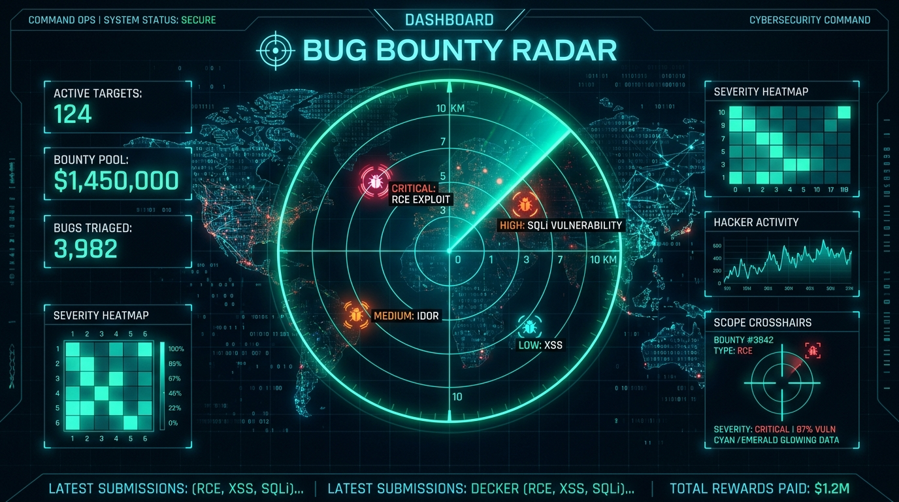
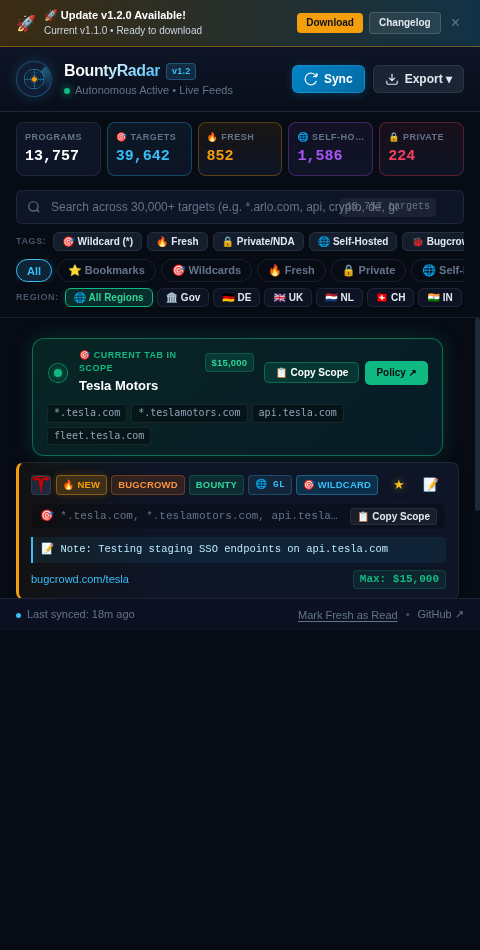
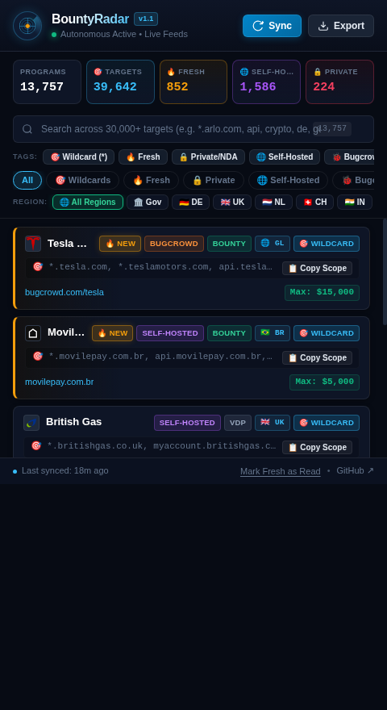

# BountyRadar 📡
> **Autonomous Fresh Bug Bounty & VDP Discovery Radar**  
> Discovers newly launched, self-hosted, and unlisted bug bounty programs in the background without needing to visit websites.

[](LICENSE)
[](manifest.json)
[](https://github.com/tejassroot/BountyRadar)

<p align="center">
  
</p>

---

## 📸 Interface & Live Radar Preview

<p align="center">
  
  &nbsp;&nbsp;&nbsp;&nbsp;
  
</p>

> **Left (v1.2 Showcase):** In-app auto-update notifications, **Active Tab Target Sniffer** (detects current browsing targets), ⭐ Bookmarks, 📝 Private Recon Notes, and multi-tool exports.  
> **Right:** Cyberpunk Bento Grid with 5 reactive metric cards (**13,757+ Programs**, **39,642+ Targets**, **852+ Fresh**, **1,586+ Self-Hosted**, **224+ Private**), global regional radar, and 1-click scope copy.

---

## ⚡ How It Works (Without Visiting Sites)

Traditional browser extensions require you to manually browse to target websites before they detect anything. **BountyRadar** inverts this model:

1. **Autonomous Feed Ingestion**: In the background, BountyRadar pulls from live global trackers: **Disclose.io (diodb)**, **HackerOne**, **Bugcrowd**, **ProjectDiscovery**, **Intigriti**, **YesWeHack**, plus **3,500+ in-scope Wildcards** and **36,000+ Target Domains**.
2. **Massive Index of 12,500+ Organizations & 30,000+ Targets**: Dynamically aggregates over **12,500+ verified bug bounty & VDP organizations** and **30,000+ in-scope target domains** across 20+ countries and sovereign extensions.
3. **🎯 Dedicated Wildcard Scope Radar**: Filter directly by wildcard targets (`*.example.com`) across 1,800+ programs for deep subdomain takeover & enumeration workflows.
4. **🌍 Global Country & TLD Regional Radar**: Automatically detects and tags programs by national domain extensions and sovereign regions (`🏛️ .gov`, `🇩🇪 .de`, `🇬🇧 .uk`, `🇳🇱 .nl`, `🇨🇭 .ch`, `🇮🇳 .in`, `🇦🇺 .au`, `🇨🇦 .ca`, `🇫🇷 .fr`, `🇪🇺 .eu`, `🎓 .edu`, `🇧🇷 .br`, `🌐 US/Global`).
5. **Zero-Click Auto-Sync**: Automatically checks and syncs live feeds on browser startup and popup launch—no manual buttons required.
6. **Diff & Fresh Discovery Engine**: Tracks newly added programs and flags them with `🔥 NEW`.
7. **1-Click Scope Copy**: Copy all in-scope domains formatted line-by-line, ready to pipe into `subfinder`, `httpx`, or `nuclei`.

---

## 🚀 Installation Guide

BountyRadar works identically on **Windows**, **Linux**, and **macOS** across any Chromium or Firefox-based browser.

### Step 1: Download the Repository

#### Option A: Via Git (Windows / Linux / macOS)
```bash
git clone https://github.com/tejassroot/BountyRadar.git
```

#### Option B: Download as ZIP (No Git Required)
1. Click the green **Code** button at the top of this repository.
2. Click **Download ZIP**.
3. Extract the downloaded `BountyRadar-main.zip` folder on your computer.

---

### Step 2: Load into Your Browser

#### 🌐 Google Chrome, Brave, Microsoft Edge, Opera (Windows & Linux)
> *Recommended: Stays permanently installed across all browser sessions.*

1. Open your browser and navigate to the extensions page:
   - **Chrome**: `chrome://extensions`
   - **Brave**: `brave://extensions`
   - **Edge**: `edge://extensions`
2. Toggle on **Developer mode** (switch in the top-right corner).
3. Click the **"Load unpacked"** button in the top-left corner.
4. Select the extracted `BountyRadar` folder (containing `manifest.json`).
5. **Done!** Click the puzzle icon (🧩) on your browser toolbar and pin **BountyRadar**.

---

#### 🦊 Mozilla Firefox (Windows & Linux)
1. Open Firefox and type in the address bar:
   ```text
   about:debugging#/runtime/this-firefox
   ```
2. Click **"Load Temporary Add-on…"**.
3. Open the `BountyRadar` folder and select the [`manifest.json`](manifest.json) file.
4. Pin the icon to your toolbar from the Extensions (🧩) menu.

*Or run from terminal with live reload:*
```bash
# Linux / macOS
cd BountyRadar && npx web-ext run

# Windows (PowerShell / Command Prompt)
cd BountyRadar; npx web-ext run
```

---

## 🎯 Features & Usage

| Feature | Description |
| :--- | :--- |
| **🚀 In-App Auto-Updates** | Checks GitHub releases in the background and alerts researchers with 1-click update downloads. |
| **🎯 Active Tab Target Sniffer** | Instantly highlights when you browse an in-scope website (`💰 $15,000` / `🎯 In-Scope`). |
| **🧰 Multi-Tool Exporter** | 1-Click exports for **Nuclei** (`targets.txt`), **Burp Suite Scope** (`burp_scope.json`), and **Subfinder**. |
| **⭐ Bookmarks & 📝 Notes** | Star favorite programs and write private confidential recon notes directly onto target cards. |
| **⚡ Zero-Click Sync** | Automatically pulls fresh data on startup; no manual sync clicking needed. |
| **🎯 Wildcard Radar** | Isolate 1,800+ wildcard domain programs (`*.example.com`) for massive subdomain expansion. |
| **🌍 Country & TLD Radar** | Filter across 20+ national and sovereign domains (`.gov`, `.de`, `.uk`, `.nl`, `.in`, `.ch`, `.au`, `.ca`, `.fr`, etc.). |
| **♾️ Unlimited Live Ingestion** | Ingests 13,750+ programs and 39,600+ targets dynamically with cache-busting live diffs. |
| **📊 5-Card Bento Grid** | Real-time counts for **Programs**, **🎯 Targets**, **🔥 Fresh**, **🌐 Self-Hosted**, and **🔒 Private**. |
| **📋 1-Click Scope Copy** | Click **"Copy Scope"** on any program to copy all target domains formatted for recon CLI tools. |
| **🏷️ Asset Category Chips** | Filter across `Web`, `API`, `Mobile`, `Cloud`, `Crypto`, and `Hardware/IoT`. |
| **🔍 Smart Search & Hotkey** | Press **`/`** to focus search across 30,000+ target domains, companies, countries, and platforms. |

---

## 🛠️ Tech Stack & Structure

```text
BountyRadar/
├── manifest.json       # Manifest V3 cross-browser configuration
├── background.js       # Background service worker & auto-sync alarms
├── feeds.js            # Multi-source parser (Disclose.io, H1, Bugcrowd, etc.)
├── popup.html          # Cyber-obsidian bento grid dashboard
├── popup.css           # Glassmorphic responsive dark stylesheet
├── popup.js            # Reactive state, token search & clipboard integration
├── icons/              # Extension brand assets (16px, 48px, 128px)
├── assets/images/      # Interface preview screenshots and hero banner
└── dist/               # Packaged production zip release
```

---

## 🤝 Contributing & License
Contributions, feedback, and feed additions are welcome! Open an issue or pull request.  
Licensed under the [MIT License](LICENSE).
